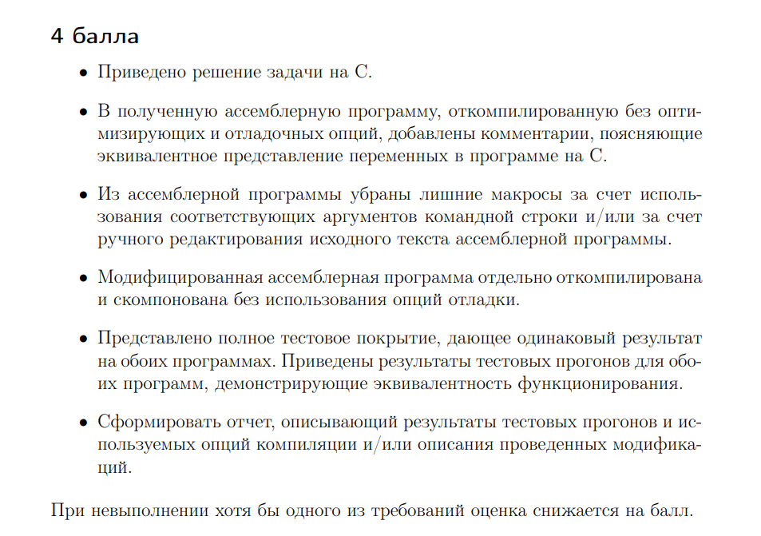
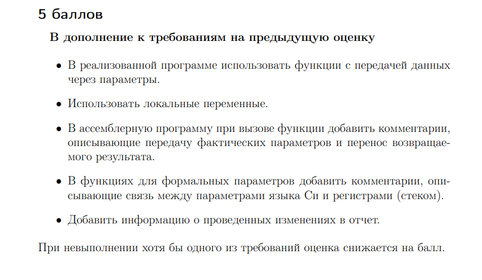

# AVS_HW3
Третье идз АВС
# 4 балла
  > 
## Программа на C
[Здесь](/C_code/)
## Предоставлю сразу отредактированный код
[Здесь](/5point/mainAs.s)

Если вам интересны комментарии:
```sh
	.file	"main.c"
	.intel_syntax noprefix
	.text
	.local	START							# строка в которой ищем подстроку.
	.comm	START,1000,32					    	# выделение памяти на строку.
	.local	SEARCHABLE						# искомая подстрока.
	.comm	SEARCHABLE,1000,32					# выделение памяти в подстроку.
	.globl	randomDate						# объявление функции рандомной генерации данных.
	.type	randomDate, @function
 ```
 ## Тестирование
 Тесты расположены в данной [директории](/tests/).
 
 Результаты тестов сишного кода.
  > 
  
  Ввод данных для тестирования ассемблера.
  
  > 


## Компилирование и компановка без использования опции отладки.
> 
## Вывод.
По результатам тестов мы видим, что и там, и там тесты проходят корректно. Также корректно обрабатываются неккоректные значения.

# 5 баллов 

  > 

## Передача данных через параметры 
Реализована в программе на 4 балла.
## Локальные переменные
Реализованы в программе на 4 балла.
## Два пункта о комментировании.
Можете взглянуть на код [здесь](/5point/)

# 6 баллов
  > 
## Редактирование кода

Заменил -4[rbp] на r13d

Заменил -8[rbp] на r13d

заменил -20[rbp] на r14d

Получил отредактированный [код](/6point/max.s)

Данная программа прошла все тесты, что подтверждает ее работоспособность.
Попытался минимизировать использования стека, заменной на данные регистры.

## 7 баллов
  > 

Все пункты реализованы в прошлых пунктах

## 8 баллов
  > 
Отсчет времени можно увидеть в блоке на 4 балла, во время провведения тестов
